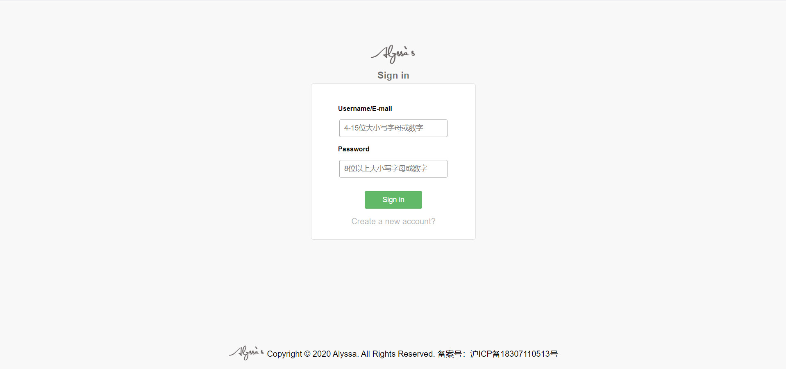
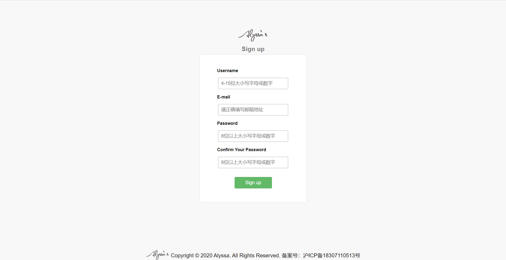
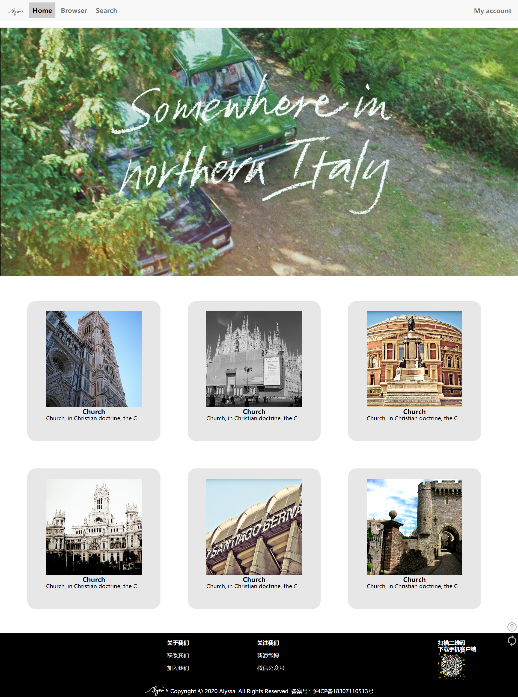
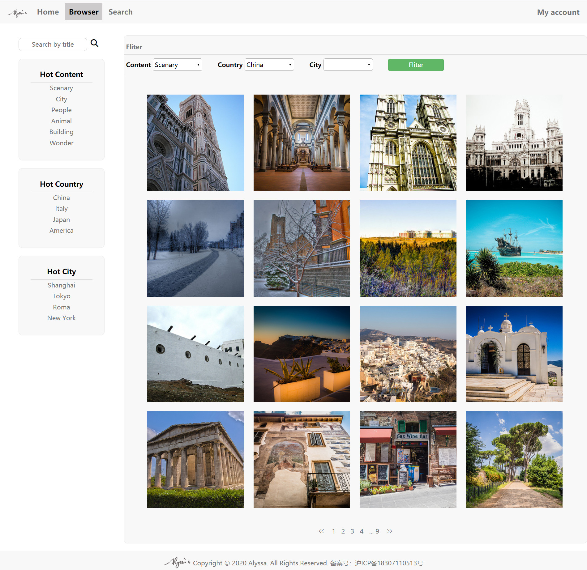
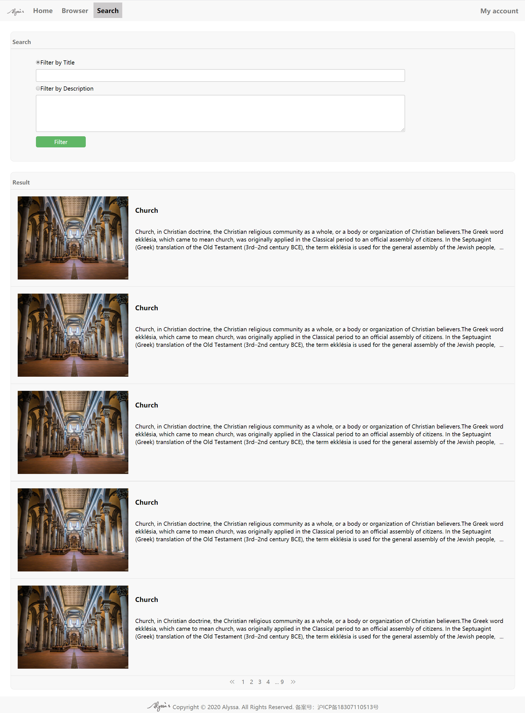
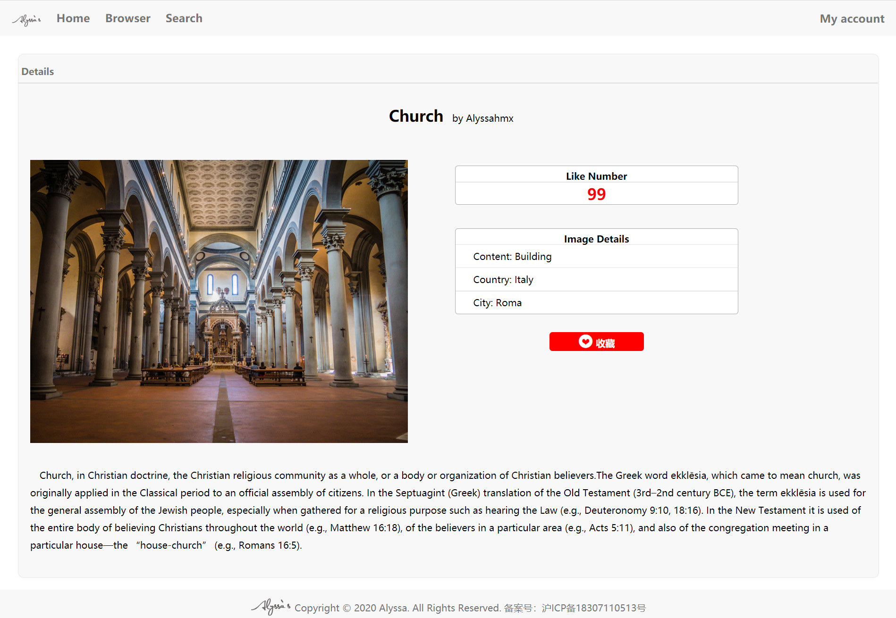
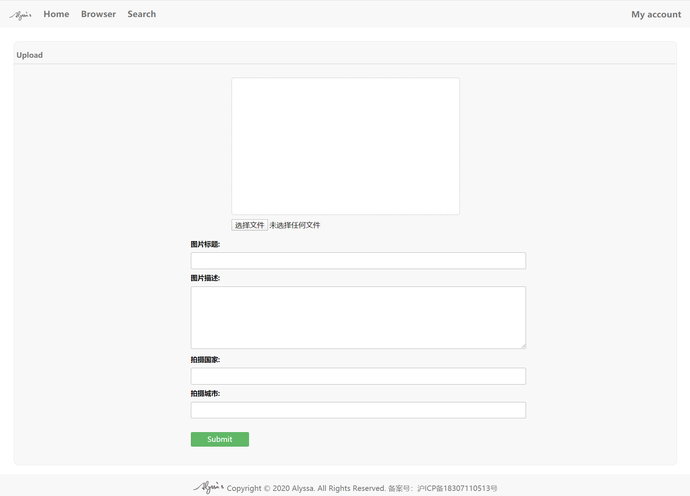
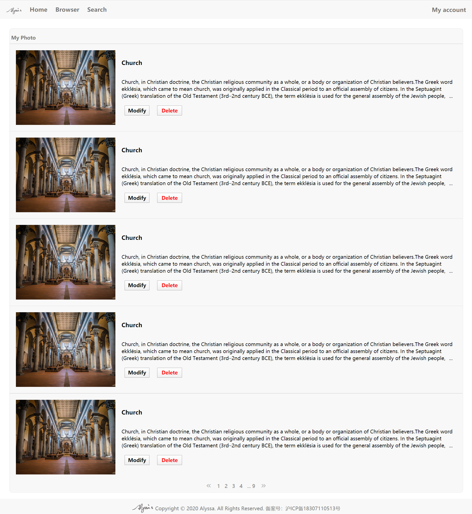
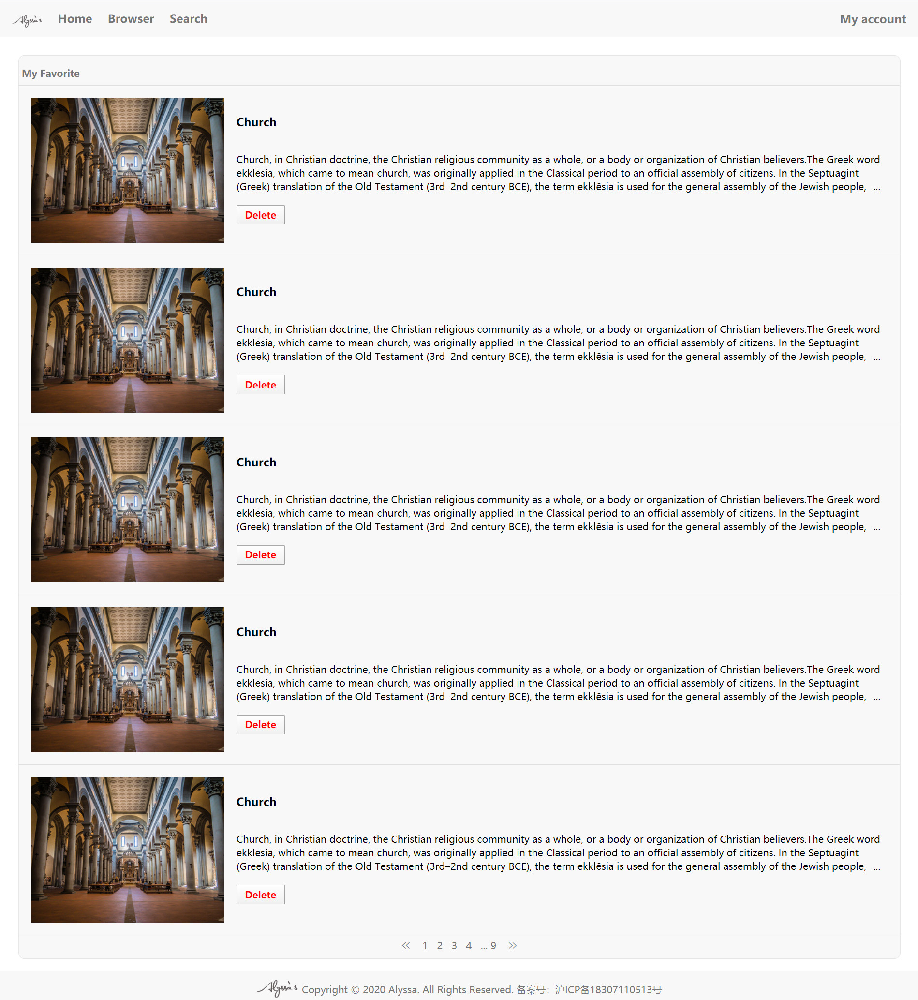
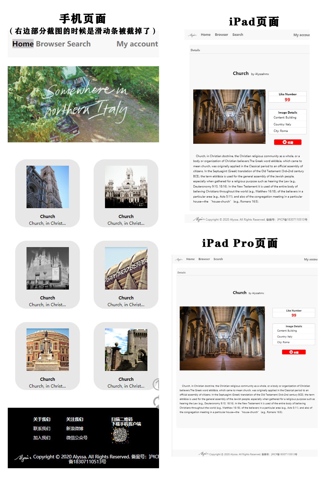

# Project1说明报告
#### **1、个人信息**

姓名：韩梦漩

学号：18307110513


#### 2、网页地址

Github: https://github.com/alyssahmx/Project1_2020 

Github page: https://alyssahmx.github.io/Project1_2020/


#### 3、项目完成情况

基本按照要求文档完成了网页设计，截图如下所示


**登录页**：


**注册页**：


**首页**：


**浏览页**：




**搜索页**：




**详情页**：




**上传页**：




**我的照片页**：




**收藏页**：




#### 4、Bouns完成情况

##### 4-1图片处理

在Home和Browser的页面中，引入了没有裁剪的normal类图片。在Home和Browser的css中设置了图片的固定宽和高，然后使用

```
object-fit:cover
```

对图片进行裁剪，使其在页面上以正方形的样式展示。


##### 4-2 响应式布局

首先在所有页面的css中引入了以下代码，将屏幕按照宽度分成三类（对应手机、平板和Chrome里面显示的iPad Pro一类）

```
@media only screen and (min-width: 980px) and (max-width: 1200px) {}

@media only screen and (min-width: 640px) and (max-width: 980px) {}

@media only screen and (max-width: 640px) {}
```

然后再按照这三类对布局分别作出改变。

**手机页面中(以iPhone为例)**：导航栏中去掉了logo的部分以保证导航条显示完整，页脚的图片和字号缩小，有侧边栏的页面均不显示侧边栏，部分页面的主体部分取消了左右外边距。在展示缩略图+标题+描述的页面中将标题和描述移至图片的下方进行展示。图片栏、按钮、输入框等都进行了缩小处理，Home和Browser页面中的图片排版均改为一行展示两张图片。

**平板页面中(以iPad和iPad Pro尺寸为例)**：页面保留完整但进行了一定程度的缩小，侧边栏、图片栏、按钮、输入框等都进行了缩小以保证适应页面宽度。在竖向屏幕展示时将页脚向下拉，在登录和注册页面中将主体部分向下移动使其处在页面中央。

**示例如下**：

#### 5、意见和建议：

感觉在写Pj的时候有很多东西是没有学过的，需要自学很多内容（是我太菜了），要做的工作还是不少的（x)
